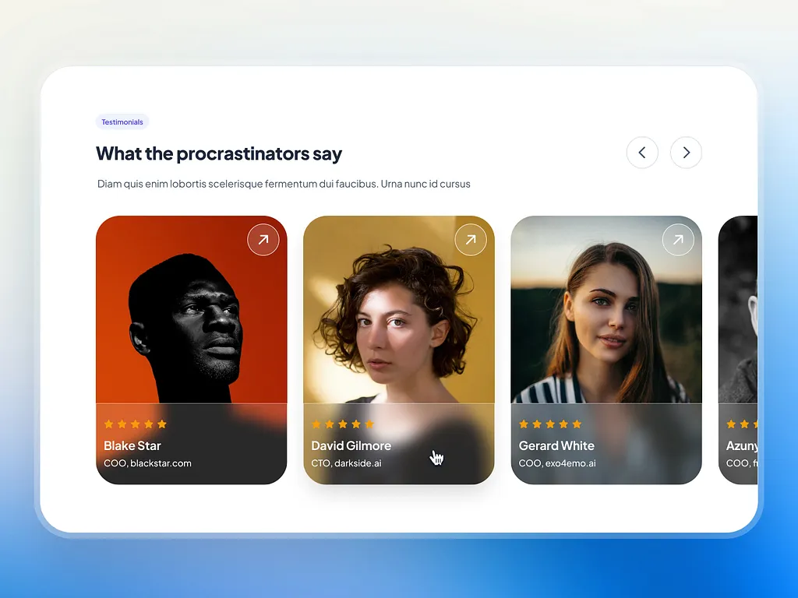

Design inspirasjon:

---

CSS Advanced Assignment 3: Using Animation, Transition & Transoform

Mål:
Målet med denne oppgaven er å hjelpe deg å øve på å bruke CSS-animation, Transition og transform for å lage interaktive og visuelt tiltalende elementer på en nettside. Du vil bruke kreativiteten din og de CSS-teknikkene du har lært til å designe en engasjerende layout eller interaktiv komponent.

Krav til oppgaven:
Sideoppsett og Struktur:
Lag en enkel nettside med minst 3 forskjellige seksjoner (for eksempel: header, hovedinnhold, footer).
Inkluder minst én knapp, én lenke og ett bilde på siden.

Animation:
Bruk CSS @keyframes for å animere minst ett element på siden. Animasjonen skal inkludere minst to eller tre trinn (bruk prosentverdier som 0%, 50%, 100%).

Eksempler på animasjoner:
En ball som hopper.
En tekst som fader inn og beveger seg.
En knapp som endrer farge og skaleres når den hovres på.

Transition:
Legg til jevne Transition på elementer som knapper, lenker eller bilder.
Bruk transition for å lage effekter ved hover eller når et element får fokus (for eksempel endre bakgrunnsfarge, endre størrelse).

Eksempler på Transitions:
Endre fargen på en knapp når den hovres på.
Skaler et bilde jevnt når brukeren hovrer på det.
En tekstblokk som endrer opasitet når brukeren hovrer på den.

Transform:
Bruk CSS-transformasjoner på minst ett element.
Bruk rotate, scale, translate eller skew for å få elementet til å bevege seg eller endre størrelse eller orientering.
Eksempler på transformasjoner:
Roter et element når siden lastes.
Få et bilde til å zoome inn når brukeren hovrer på det.
Skew (skjev) en tittel eller overskrift for å gi en 3D-effekt.

Kombinere Animation, Transition og Transform:
Prøv å kombinere animasjoner, overganger og transformasjoner på ett element.
For eksempel kan en knapp skalere opp og endre farge når brukeren hovrer på den, og teksten inni kan også animere med en fade-in effekt ved hjelp av keyframes.
Bonusutfordring (Valgfritt):
Lag et interaktivt meny- eller kort-design som bruker en kombinasjon av animasjoner, overganger og transformasjoner. Når brukeren hovrer på menyen eller kortet, skal flere transformasjoner og overganger anvendes (for eksempel skalering, rotasjon, endring av farge eller posisjon).

---

NOTATER:

komponent som viser filmer i en karusell svarer godt på opggaven på en enkel måte og kan vise Animation, Transition & Transoform.

Idéer:
Kortet's bilde blir litt lysere og saturated på hover, bildet zoomer litt inn og blir litt større.

Keyframes når siden åpnes, som laster et og et kort fra venstre til høyre.

inspirasjon legges i design folder.

Theme:
mørk tema / netflix design, komponenten viser nye filmer og serier å se på en simpel måte.

Tekst på siden:
tag: Top 10 new movies (red element with a darker red text similar to netflix color palette)
title: Our new recommended shows
description: These are the brand new movies and series to watch from the past year

Filmer og beskrivelser å inkludere:

#1 - Stranger Things Season 5: Final battle against Vecna as Upside Down invades Hawkins. (strangerThings.webp)

#2 - Lilo & Stitch (Movie): Lonely Hawaiian girl adopts chaotic alien as her pet. (lilo.webp)

#3 - Severance Season 2 (Series): Workers face dire consequences crossing severance lines. (severance.webp)

#4 - A Minecraft Movie (Movie): Four misfits enter Minecraft world for a magical quest. (minecraft.webp)

#5 - Jurassic World Rebirth (Movie): Team extracts dino DNA in equatorial wilds for cure. (jurassic.webp)

#6 - Superman (Movie): Superman balances Kryptonian roots and human life vs Lex. (superman.webp)

#7 - The Pitt (Series): Doctors battle chaos in underfunded Pittsburgh ER. (thePitt.webp)

#8 - Andor Season 2 (Series): Rebel spy Cassian's path intensifies toward war. (andor.webp)

#9 - Zootopia 2: Cops Judy and Nick chase mysterious reptile in city. (zootopia.webp)

#10 - Daredevil: Born Again (Series): Daredevil clashes with Kingpin as old lives resurface. (daredevil.webp)
